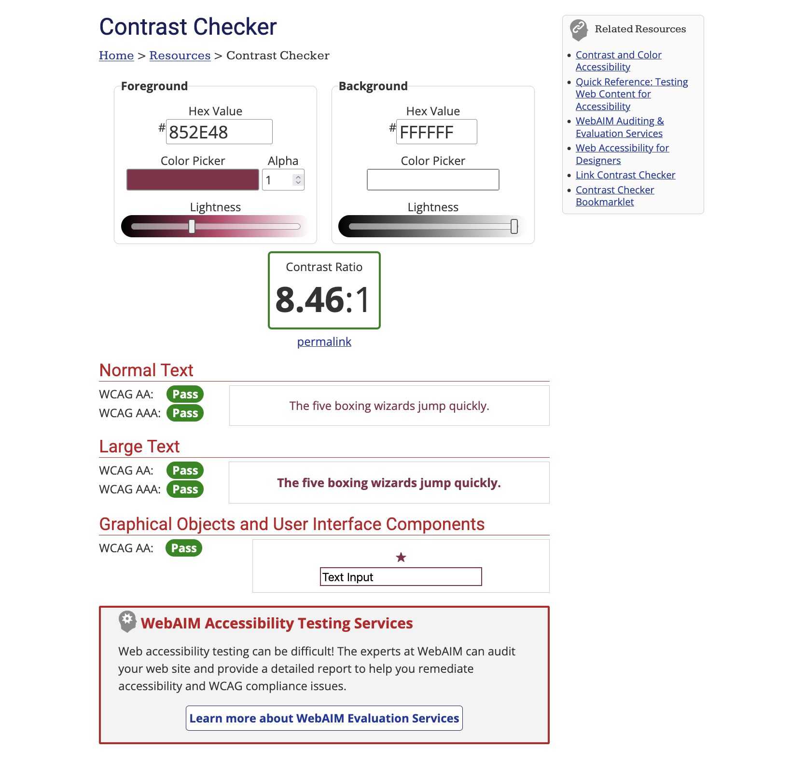

# Rapport de contraste

Cette page présente les vérifications de contraste que j'ai réalisées pour garantir une bonne lisibilité du contenu et respecter les recommandations d'accessiblité.

---

## Outil utilisé

Mes contrastes ont été vérifiés sur ce service :

[WebAIM Contrast Checker](https://webaim.org/resources/contrastchecker/)

Cet outil permet de vérifier les contrastes de couleurs selon les critères WCAG (Web Content Accessibility Guidelines).
 
---

## Vérification des contrastes

Je n'ai vérifié qu'une combinaison de couleurs, car je n'en ai utilisé qu'une seule dans l'application. Elle a été analysée pour assurer un niveau de contraste suffisant pour tous les utilisateurs.

### Résultat de l'analyse

*Figure 1 — Résultat de la vérification des contrastes avec WebAIM Contrast Checker.*

---

## Observations

Les vérifications faites montrent que :

- les textes restent lisibles sur l'arrière-plan ;
- les couleurs respectent les recommandations d'accessibilité ;
- les contrastes sont suffisants pour avoir une lecture confortable du contenu.

---

## Conclusion

L'analyse que j'ai réalisée montre que les constrastes utilisés dans l'application répondent aux exigences d'accessiblité et assurent une bonne expérience de lecture pour les utilisateurs.

Les problèmes rencontrés pendant le développement ont été corrigés afin d'avoir un rapport constrate conforme aux normes WCAG.

---

[Retour à l'accueil](../)
