# Qualité du code HTML

Cette page présente les éléments qui permettent de savoir la qualité du code HTML fait dans le cadre du projet.

---

## 1. Structure des titres (Headings Map)

J'ai porté une attention particulière pour la hiérachie des titres afin d'avoir une structure claire du contenu et une bonne accessibilité.

### Page d'accueil

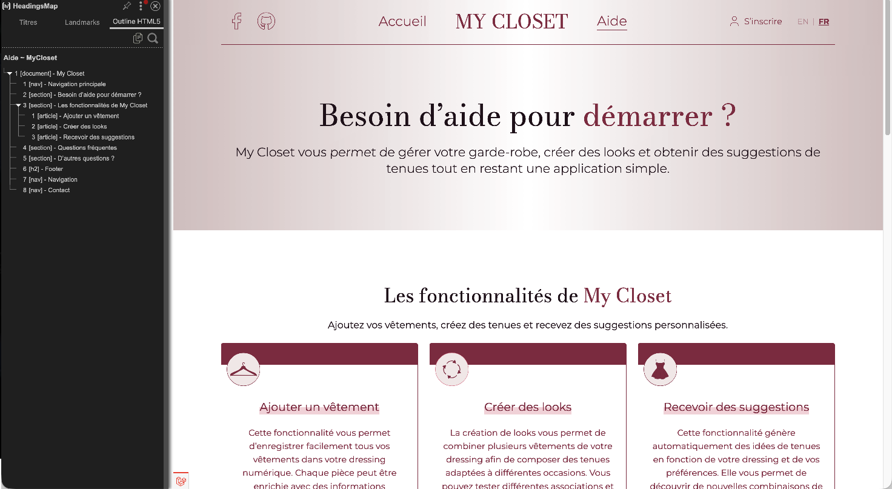

*Figure 1 — Structure des titres de la page d'accueil.*

### Page d'aide

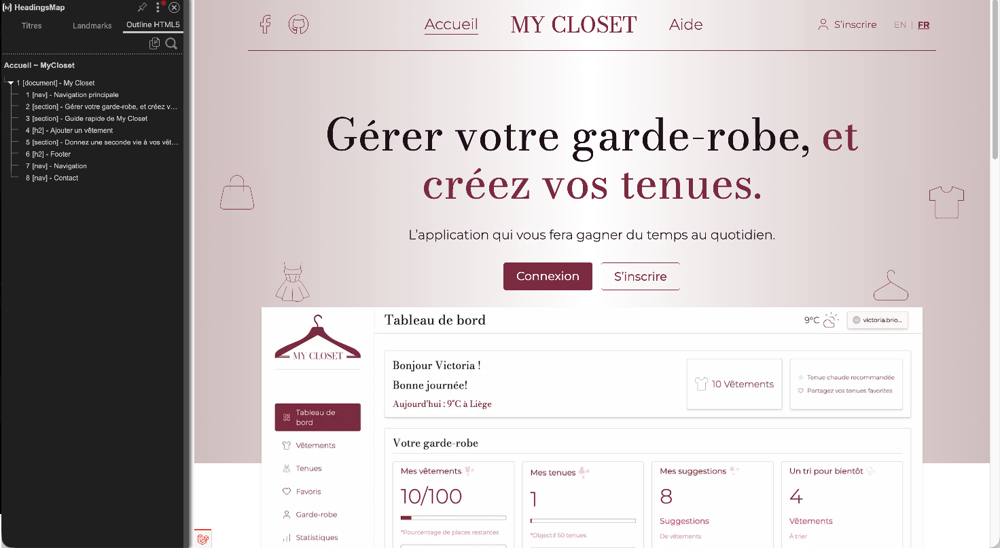

*Figure 2 — Structure des titres de la page d'aide.*

### Observations

- Présence d'un unique titre principal (`H1`) par page.
- Respect de la hiérarchie des niveaux de titres.
- Structure cohérente facilitant la navigation et l'accessibilité.

---

## 2. Validation HTML

Toutes les pages du site ont été analysées à l'aide de **Total Validator** pour vérifier leur validation HTML, seul les pages me semblant pertinentes ont été reprise ici.

### Résultat des pages

#### Page d'accueil

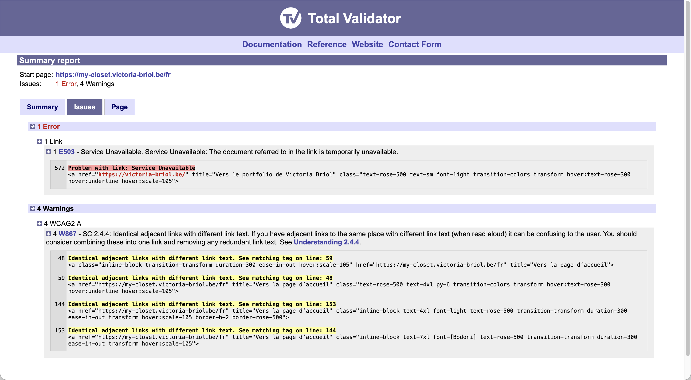

*Figure 3 — Résultat de la validation HTML sur la page d'accueil.*

#### Page d'aide

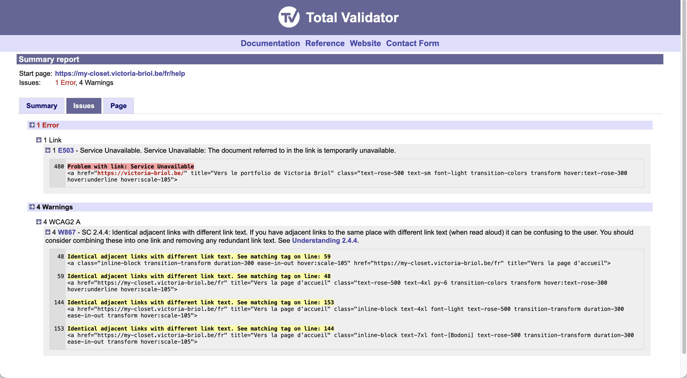

*Figure 4 — Résultat de la validation HTML sur la page d'aide.*

#### Page de login

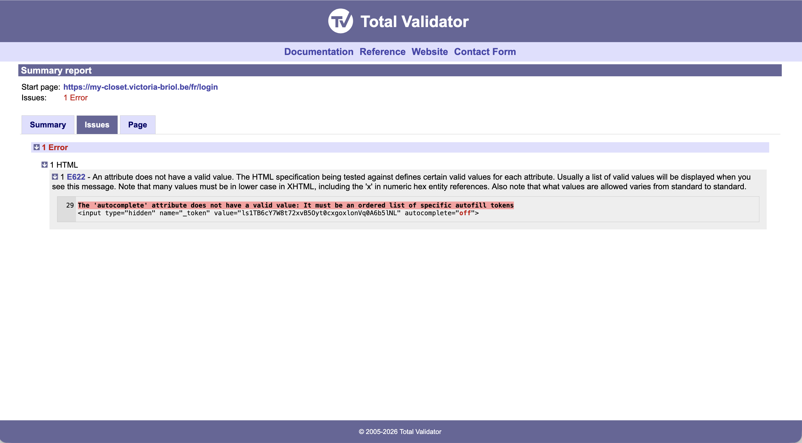

*Figure 5 — Résultat de la validation HTML sur la page de login.*

#### Page de register

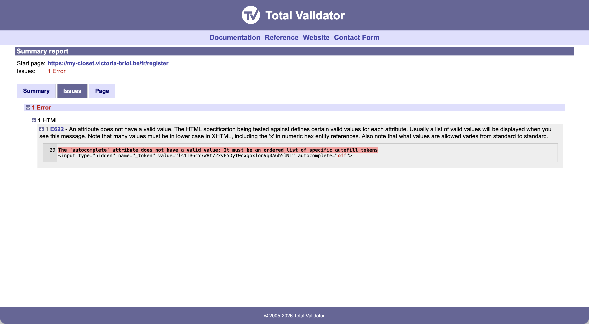

*Figure 6 — Résultat de la validation HTML sur la page de register.*

#### Page dashboard

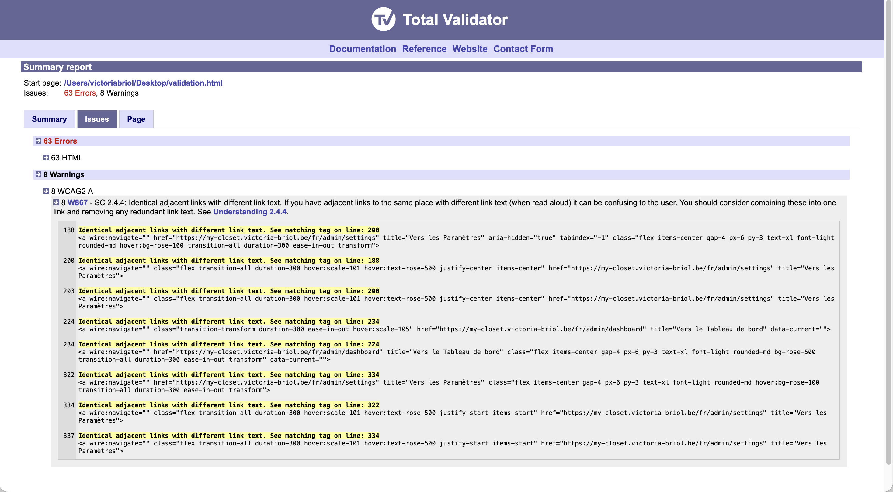

*Figure 7 — Résultat de la validation HTML sur la page dashboard.*

#### Page de Clothes-Index

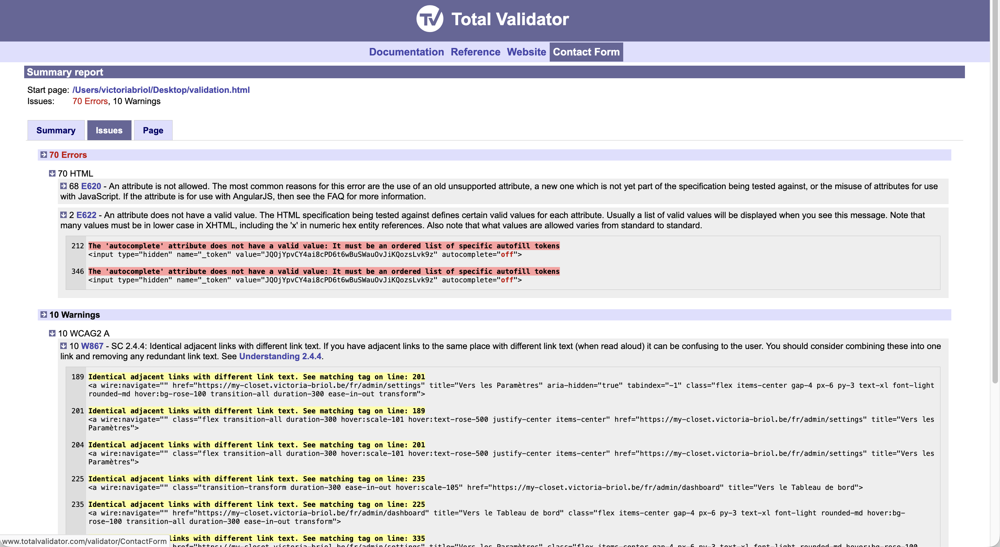

*Figure 8 — Résultat de la validation HTML sur la page de clothes index.*

#### Page de Clothes-Create


*Figure 9 — Résultat de la validation HTML sur la page de clothes create.*

#### Page de Clothes-Show


*Figure 10 — Résultat de la validation HTML sur la page de clothes show.*

#### Page de Clothes-Edit


*Figure 11 — Résultat de la validation HTML sur la page de clothes edit.*

#### Page de Favorite


*Figure 12 — Résultat de la validation HTML sur la page de favorite.*

#### Page de Closet-Index

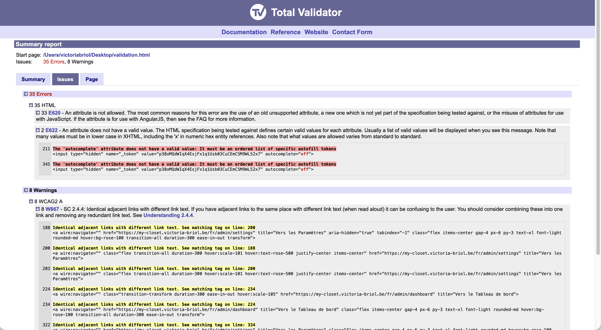

*Figure 13 — Résultat de la validation HTML sur la page de closet index.*

#### Page de Settings

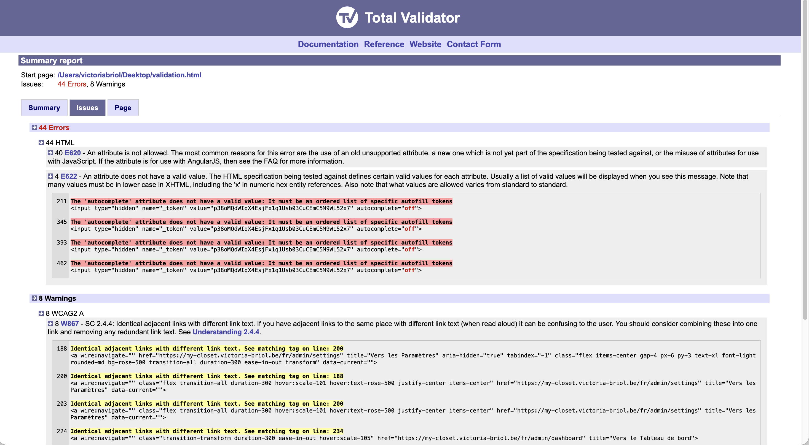

*Figure 14 — Résultat de la validation HTML sur la page de settings.*

### Analyse des résultats

Les erreurs détectées proviennent de l'utilisation de Laravel Livewire, qui ajoute des attributs que le validateur ne reconnaît pas, ainsi que du token CSRF généré automatiquement par Laravel. Ces éléments ne peuvent pas être modifiés car ils sont indispensables au bon fonctionnement de l'application.
Les avertissements sont liés au double menu de navigation (mobile et desktop) présent dans le code, ce qui est tout à fait normal pour un site responsive.

### Conclusion

Ces erreurs et avertissements ne sont donc pas de vraies erreurs de développement, mais simplement des contraintes liées aux outils et à l'architecture du projet.

---

## 3. Respect des bonnes pratiques HTML et sémantique

Le développement du projet a été réalisé en respectant les bonnes pratiques HTML ainsi que certaines recommandations de la structure sémantique.

Mon objectif est d'avoir un code lisible, accessible et maintenable.

---

### Structure sémantique du projet

La construction du projet repose sur une utilisation systématique des balises sémantiques HTML :

- `<header>` : en-tête et navigation principale
- `<main>` : contenu principal des pages
- `<section>` : découpage logique des contenus
- `<footer>` : informations de fin de page

Cette organisation améliore la compréhension du code et facilite l’accessibilité.

---

### Hiérarchie des titres

J'ai porté une attention particulière sur la hiérachie des titres :

- un seul `<h1>` par page ;
- utilisation cohérente des `<h2>`, `<h3>`, etc. ;
- structure logique respectant le contenu.

Cela permet une meilleure navigation, notamment pour les lecteurs d’écran.

---

### Accessibilité et bonnes pratiques

Plusieurs règles essentielles ont été respectées :

- utilisation systématique des attributs `alt` pour les images ;
- association correcte des labels aux champs de formulaires ;
- navigation possible au clavier ;
- structure HTML cohérente et lisible ;
- séparation claire entre structure et présentation.

---

### Analyse

Les résultats montrent que :

- la structure HTML est cohérente ;
- les éléments sémantiques sont correctement utilisés ;
- les règles d’accessibilité principales sont respectées ;
- le code reste lisible et maintenable.

---

### Conclusion

Le projet respecte globalement les bonnes pratiques HTML modernes.

Ces choix permettent d’améliorer :
- l’accessibilité ;
- la maintenabilité ;
- le référencement naturel ;
- la qualité globale du code.

---

## 4. Utilisation des microdatas

Une page utilise des microdatas Schema.org afin d'améliorer la compréhension du contenu par les moteurs de recherche.

### Implémentation

```html
@props([
    'title',
    'sub_title',
    'details',
])

<section
    class="bg-linear-to-r from-amber-800 via-amber-50 to-amber-800">
    <div class="section-public max-w-440 m-auto justify-center flex flex-col gap-6">
        <div itemscope itemtype="https://schema.org/FAQPage">
            <div itemscope itemprop="mainEntity" itemtype="https://schema.org/Question" class="flex flex-col gap-3">
                <h2 itemprop="name"
                    class="font-[Bodoni] text-5xl lg:text-7xl text-rose-900 font-normal text-center">{!! $title !!}</h2>
                <div itemscope itemprop="acceptedAnswer" itemtype="https://schema.org/Answer">
                    <p itemprop="text"
                       class="text-base lg:text-lg text-rose-900 font-normal text-center">{!! $sub_title !!}</p>
                </div>
            </div>
        </div>

        <div class="flex flex-col gap-3 2xl:grid 2xl:grid-cols-13">
            @foreach($details as $detail)
                <x-public.helper.faq_details
                    :title="$detail['title']"
                    :content="$detail['content']"
                    :image_path="$detail['image_path']"
                    :image_alt="$detail['image_alt']"
                />
            @endforeach
        </div>
    </div>
</section>

```

### Validation

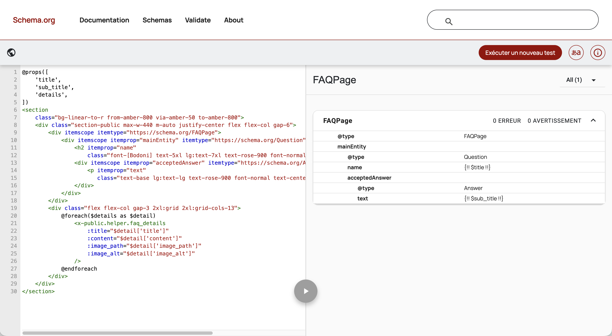

*Figure 15 — Vérification des microdatas de la page d'aide.*

### Conclusion

Les microdonnées vont permettrent d'enrichir les informations fournies aux moteurs de recherche.

---

## 5. Optimisation des images

Les images ont été optinisées pour améliorer les performances du site et réduire les temps de chargement.

### Redimensionnement côté serveur

Quand c'est pertinent, plusieurs versions d'une même image ont été générées pour éviter le téléchargement d'images trop volumineux non nécessaire.

Ceci permet :

- de réduire le poids des pages ;
- d'améliorer les temps de chargement ;
- de limiter la consommation de bande passante ;
- d'améliorer les performances mesurées par Lighthouse.

### Utilisation de `srcset`

Les images responsives utilisent l'attribut `srcset` pour proposer automatiquement une version adaptée à la taille de l'écran.

#### Code généré

```html

```

### Image dans le site de l'utilisation de srcset


*Figure 16 — Utilisation de l'attribut srcset.*

### Résultats obtenus

Les optimisations permettent :

- une meilleure expérience utilisateur sur mobile ;
- une réduction du volume de données téléchargées ;
- un chargement plus rapide des pages ;
- une amélioration des indicateurs de performance.

---

## Conclusion générale

Les différentes vérifications réalisées démontrent le respect des bonnes pratiques HTML du projet :

- structure cohérente des titres ;
- conformité du code HTML ;
- utilisation de balises sémantiques ;
- intégration de microdonnées ;
- optimisation du chargement des images.

Ces éléments contribuent à améliorer l'accessibilité, la maintenabilité et les performances globales de l'application.

---

[Retour à l'accueil](../)
