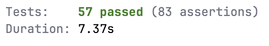

# Tests automatisés

Cette page présente un ensemble des tests automatisés réalisés dans le cadre du projet.

L'application dispose de **57 tests automatisés au total**(seulement 30 sont présent à la fin du document), couvrant à la fois les fonctionnalités serveur (backend) et les scénarios utilisateur (browser testing).

---

# 1. Répartition des tests

Les tests sont répartis en deux catégories :

- Tests côté serveur 
- Tests de type browser

Cette séparation permet de valider à la fois la logique métier et les parcours utilisateur complets.

---

# 2. Tests côté serveur

Les tests backend permettent de vérifier le bon fonctionnement des règles métier, des contrôleurs et des modèles.

## Exemples de tests réalisés

- Authentification utilisateur
- Inscription utilisateur
- Gestion des rôles et permissions
- Création d’enregistrements
- Mise à jour de données
- Suppression de ressources
- Validation des formulaires
- Accès aux routes protégées

### Exemple de test

```php
it('verifies if a user cannot register without a name', function () {
    $response = $this->post(route('register', app()->getLocale()), [
        'name' => '',
        'email' => 'vic@test.com',
        'password' => 'password',
        'password_confirmation' => 'password',
    ]);

    $response->assertSessionHasErrors('name');
});
```

---

# 3. Tests Browser 

Les tests browser simulent le comportement réel d’un utilisateur dans l’application.

## Exemples de scénarios testés

- Navigation sur le site public
- Connexion utilisateur
- Remplissage de formulaires
- Création de contenu
- Interaction avec les interfaces dynamiques
- Vérification des messages d’erreur
- Flux complet utilisateur (inscription → action principale)

### Exemple de test browser

```php
it('can logout', function () {
    $user = User::factory()->create();
    actingAs($user);

    visit(route('dashboard'))
        ->assertSee('Dashboard')
        ->click('.logout_browser_selector')
        ->assertSee('Log in');
});
```

---

# 4. Volume de tests

L’application contient au total :

- **57 tests automatisés**
  - environ 30+ tests backend
  - environ 15+ tests browser
  - tests supplémentaires pour cas limites et erreurs

---

# 5. Résultats des tests

### Capture des résultats



---

# 6. Analyse

Les tests permettent de garantir :

- la stabilité des fonctionnalités principales ;
- la non-régression lors des modifications ;
- la fiabilité des parcours utilisateurs.

---

# 7. Les 30 tests 

## Tests côtés serveur

### 1

```php
it('verifies if a user can register with valid data', function () {
    $this->post(route('register', app()->getLocale()), [
        'name' => 'Vic',
        'email' => 'vic@test.com',
        'password' => 'password',
        'password_confirmation' => 'password',
    ]);

    $this->assertDatabaseHas('users', [
        'email' => 'vic@test.com',
    ]);

    $this->assertAuthenticated();
    $this->get(route('dashboard'))
        ->assertStatus(200);
});
```

### 2

```php
it('verifies if a user cannot register without a name', function () {
    $response = $this->post(route('register', app()->getLocale()), [
        'name' => '',
        'email' => 'vic@test.com',
        'password' => 'password',
        'password_confirmation' => 'password',
    ]);

    $response->assertSessionHasErrors('name');
});
```

### 3

```php
it('verifies if a user cannot register with duplicate email', function () {
    User::factory()->create([
        'email' => 'vic@test.com',
    ]);

    $response = $this->post(route('register', app()->getLocale()), [
        'name' => 'Vic',
        'email' => 'vic@test.com',
        'password' => 'password',
        'password_confirmation' => 'password',
    ]);

    $response->assertSessionHasErrors('email');
});
```

### 4

```php
it('verifies if a user cannot login with wrong password', function () {
    $user = User::factory()->create([
        'password' => 'password',
    ]);

    $response = $this->post(route('login', app()->getLocale()), [
        'email' => $user->email,
        'password' => 'wrong-password',
    ]);

    $response->assertSessionHasErrors();
});

```

### 5

```php
it('guest cannot access closet index', function () {
    $this->get(route('closet.index'))
        ->assertRedirect(route('login',['locale' => app()->getLocale()]));
});
```

### 6

```php
it('authenticated user can access closet create page', function () {
    $user = User::factory()->create();

    $this->actingAs($user)
        ->get(route('closet.create', ))
        ->assertSee(__('admin/closet/closet_create_edit.create.page_title'));
});
```

### 7

```php
it('user only sees their own closets on index', function () {
    $user  = User::factory()->create();
    $other = User::factory()->create();

    Closet::factory()->create(['user_id' => $user->id,  'name' => 'Ma garde-robe']);
    Closet::factory()->create(['user_id' => $other->id, 'name' => 'Garde-robe étrangère']);

    $this->actingAs($user)
        ->get(route('closet.index'))
        ->assertOk()
        ->assertSee('Ma garde-robe')
        ->assertDontSee('Garde-robe étrangère');
});
```

### 8

```php
it('closet create page returns success', function () {
    $user = User::factory()->create();

    $this->actingAs($user)
        ->get(route('closet.create'))
        ->assertStatus(200);
});
```

### 9

```php
it('guest cannot access clothes create page', function () {
    $this->get(route('clothes.create'))
        ->assertRedirect(route('login', ['locale' => app()->getLocale()]));
});
```

### 10

```php
it('user can access their own clothing item', function () {
    $user   = User::factory()->create();
    $closet = Closet::factory()->create(['user_id' => $user->id]);
    $clothe = Clothe::factory()->create(['closet_id' => $closet->id]);

    $this->actingAs($user)
        ->get(route('clothes.show', $clothe))
        ->assertSee(__('admin/clothes/clothe_show.page_title'));
});
```

### 11

```php
it('clothe show page returns success', function () {
    $user = User::factory()->create();
    $closet = Closet::factory()->create([
        'user_id' => $user->id,
    ]);
    $clothe = Clothe::factory()->create([
        'closet_id' => $closet->id,
    ]);

    $this->actingAs($user)
        ->get(route('clothes.show', $clothe))
        ->assertStatus(200);
});

```

### 12

```php
it('guest cannot access an outfit page', function () {
    $outfit = Outfit::factory()->create();

    $this->get(route('outfits.show', $outfit))
        ->assertRedirect(route('login', ['locale' => app()->getLocale()]));
});
```

### 13

```php
it('authenticated user can access outfits index', function () {
    $user = User::factory()->create();

    $this->actingAs($user)
        ->get(route('outfits.index'))
        ->assertSee(__('admin/outfits/outfit_index.page_title'));
});
```

### 14

```php
it('outfit create page returns success', function () {
    $user = User::factory()->create();

    $this->actingAs($user)
        ->get(route('outfits.create'))
        ->assertStatus(200);
});
```

### 15

```php
it('authenticated user can access an outfit page', function () {
    $user = User::factory()->create();
    $outfit = Outfit::factory()->create();

    $this->actingAs($user)
        ->get(route('outfits.show', $outfit))
        ->assertStatus(200);
});
```

## Tests Browser 

### 1

```php
it('can access the dashboard', closure: function () {
    $user = User::factory()->create();
    actingAs($user);

    Livewire::visit('pages::dashboard')
        ->assertSee('Dashboard');
});
```

### 2

```php
it('can register a new account', function () {
    visit(route('register', app()->getLocale()))
        ->assertSee(__('auth.register_page_title'))
        ->fill('name', 'Vic')
        ->fill('email', 'vic.test@test.be')
        ->fill('password', '123456789')
        ->fill('password_confirmation', '123456789')
        ->click(__('auth.register_button'));
});
```

### 3

```php
it('verifies if we can access to the login form in french and english', function () {
    LaravelLocalization::setLocale('fr');

    visit(route('login', app()->getLocale()))
        ->assertSee('Se connecter');

    LaravelLocalization::setLocale('en');
    visit(route('login', app()->getLocale()))
        ->assertSee('Login');

});
```

### 4

```php
it('can login with valid credentials', function () {
    $user = User::factory()->create([
        'email' => 'vic.test@test.be',
        'password' => bcrypt('123456789'),
    ]);

    visit(route('login', app()->getLocale()))
        ->assertSee(__('auth.login_page_title'))
        ->fill('email', 'vic.test@test.be')
        ->fill('password', '123456789')
        ->click(__('auth.login_button'));
});

```

### 5

```php
it('can logout', function () {
    $user = User::factory()->create();
    actingAs($user);

    visit(route('dashboard'))
        ->assertSee('Dashboard')
        ->click('.logout_browser_selector')
        ->assertSee('Log in');
});
```

### 6

```php
it('can see the closets list', function () {
    $user = User::factory()->create();
    actingAs($user);

    visit(route('closet.index'))
        ->assertSee(__('admin/closet/closet_index.index.page_title'));
});
```

### 7

```php
it('can create a closet', function () {
    $user = User::factory()->create();
    actingAs($user);

    visit(route('closet.create'))
        ->assertSee('Add a closet')
        ->fill('name', 'Winter wardrobe')
        ->click('Create closet');
});
```

### 8

```php
it('displays user closets', function () {
    $user = User::factory()->create();
    actingAs($user);

    Closet::factory()->create([
        'user_id' => $user->id,
        'name' => 'Summer Closet',
    ]);

    visit(route('closet.index', app()->getLocale()))
        ->assertSee('Summer Closet');
});
```

### 9

```php
it('can edit a closet', function () {
    $user = User::factory()->create();
    $closet = Closet::factory()->create(['user_id' => $user->id, 'name' => 'Ancien nom']);

    actingAs($user);

    visit(route('closet.edit', $closet))
        ->assertSee('Edit closet')
        ->fill('name', 'Nouveau nom');
});
```

### 10

```php
it('can update a closet name', function () {
    $user = User::factory()->create();
    actingAs($user);

    $closet = Closet::factory()->create([
        'user_id' => $user->id,
        'name' => 'Old name',
    ]);

    visit(route('closet.edit', $closet))
        ->assertSee('Edit closet')
        ->fill('name', 'New name')
        ->click('Save changes');
});

```

### 11

```php
it('prevents adding clothes to another user closet', function () {
    $user = User::factory()->create();
    $other = User::factory()->create();
    $closet = Closet::factory()->create([
        'user_id' => $other->id,
    ]);
    actingAs($user);

    visit(route('clothes.create'))
        ->assertSee('Add a clothing item')
        ->fill('name', 'Hack item')
        ->click('Add clothing item');
});

```

### 12

```php
it('shows clothes in a closet', function () {
    $user = User::factory()->create();
    actingAs($user);

    $closet = Closet::factory()->create(['user_id' => $user->id]);
    $closet->clothes()->create([
        'name' => 'Sneakers',
        'color' => 'White',
    ]);

    visit(route('closet.show', $closet))
        ->assertSee('View closet')
        ->click('Edit closet');
});
```

### 13

```php
it('can create an outfit from clothes', function () {
    $user = User::factory()->create();
    actingAs($user);

    $closet = Closet::factory()->create(['user_id' => $user->id]);
    $shirt = $closet->clothes()->create(['name' => 'Shirt']);
    $pants = $closet->clothes()->create(['name' => 'Pants']);

    visit(route('outfits.create'))
        ->assertSee('Add an outfit')
        ->fill('name', 'Casual Outfit')
        ->click('Create outfit');
});
```

### 14

```php
it('can see the outfits list', function () {
    $user = User::factory()->create();
    actingAs($user);
    visit(route('outfits.index'))
        ->assertSee(__('admin/outfits/outfit_index.page_title'));
});
```

### 15

```php
it('displays clothes inside an outfit', function () {
    $user = User::factory()->create();
    actingAs($user);

    $outfit = Outfit::factory()->create([
        'name' => 'Street style',
    ]);

    $outfit->clothes()->create([
        'name' => 'Shirt',
    ]);

    visit(route('outfits.show', $outfit))
        ->assertSee('Street style')
        ->assertSee('Shirt');
});
```
---

# Conclusion

La présence de 57 tests automatisés démontre un effort important de qualité logicielle et de fiabilité de l'application.

Les tests couvrent à la fois la logique serveur et les interactions utilisateur, garantissant un comportement cohérent de l’ensemble du système.

---

[Retour à l'accueil](../)
