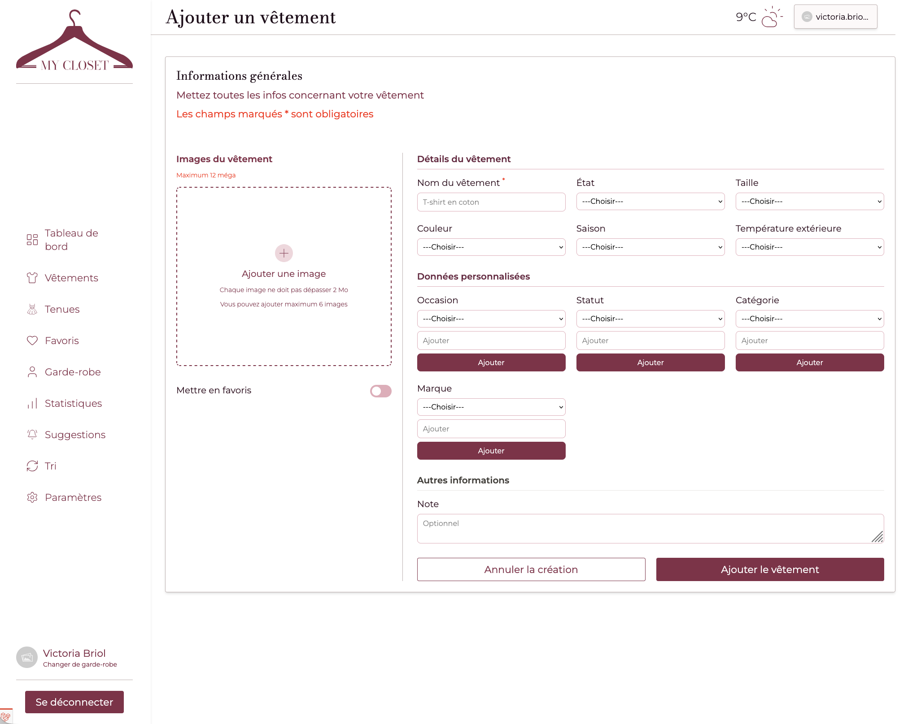
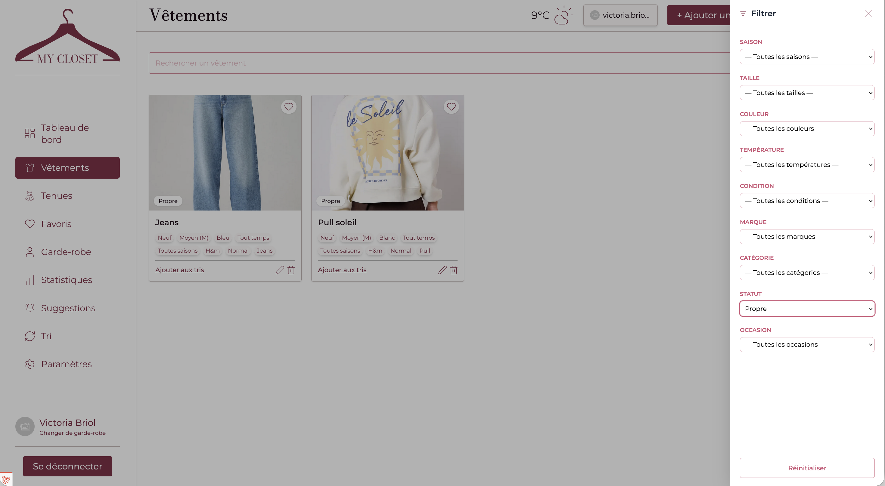
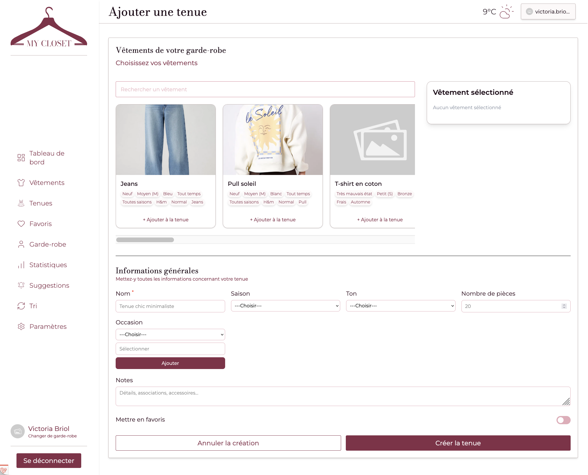
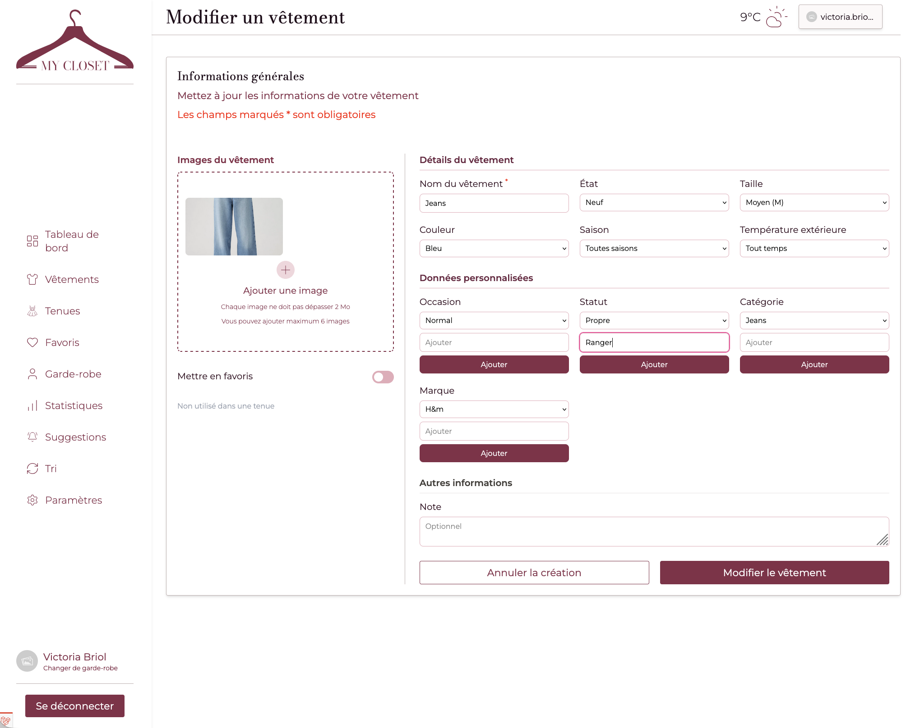
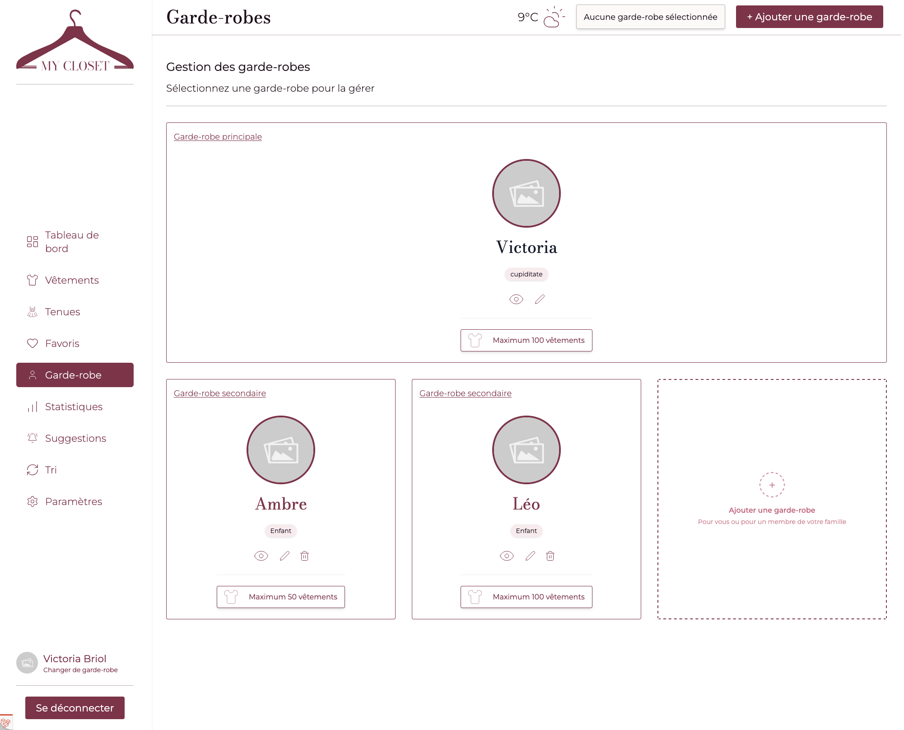

# Bilan des tests utilisateurs

Cette page présente les tests utilisateurs réalisés pour évaluer l'expérience utilisateur de l'application et vérifier son fonctionnement avec les besoins définis dans le cahier des charges.

Les tests ont été réalisés auprès de **trois personnes appartenant à la cible visée par le projet**.

Durant chaque session, les utilisateurs étaient invités à réaliser plusieurs tâches représentatives tout en verbalisant leurs actions et leurs réflexions.

---

# 1. Méthodologie

## Participants

### Utilisateur 1

- Étudiante, utilisation rapide de l'application

### Utilisateur 2

- Parent, qui doit gérer plusieurs choses à la fois et souhaitant organiser son quotidien

### Utilisateur 3

- Étudiant, peu intéressé par la mode, désirant faire les choses vite pour ne pas perdre du temps

---

## Conditions de test

Chaque utilisateur a réalisé les mêmes tâches :

1. Ajouter un vêtement
2. Filtrer ses vêtements par statut "Propre"
3. Créer une tenue en associant plusieurs vêtements
4. Changer le statut d'un vêtement
5. Naviguer entre deux garde-robes différentes

Les sessions ont été enregistrées sous forme de screencasts avec commentaires audio.

---

## Vidéos des tests

### Utilisateur 1

Lien vers la vidéo :

[Utilisateur 1](https://youtu.be/NuC9m7riQ60)

### Utilisateur 2

Lien vers la vidéo :

[Utilisateur 2](https://youtu.be/tOqNBf0AZ3w)

### Utilisateur 3

Lien vers la vidéo :

[Utilisateur 3](https://youtu.be/3Q4E8bk4UI0)

---

# 2. Analyse des tâches

## Tâche 1 : Ajouter un vêtement

### Résultats observés

| Utilisateur | Résultat |
|------------|-----------|
| Utilisateur 1 | Réussite |
| Utilisateur 2 | Réussite |
| Utilisateur 3 | Réussite |

### Observations

- Utilisateur 1 => Compréhension et mise en exécution rapides de la tâche
- Utilisateur 2 => Compréhension de la tâche. Prend le temps de mettre les bonne infos
- Utilisateur 3 => Compréhension de la tâche rapidement et ajout de certains éléments efficaces

### Capture d'écran

*Figure 1 — Image de la première tâche sur le site My Closet.*

### Conclusion

L’ajout d’un vêtement a été réalisé avec succès par l’ensemble des utilisateurs. Le formulaire est jugé compréhensible et les informations demandées sont suffisamment claires pour permettre une saisie rapide et efficace.

---

## Tâche 2 : Filtrer ses vêtements par statut "Propre"

### Résultats observés

| Utilisateur | Résultat |
|------------|-----------|
| Utilisateur 1 | Réussite  |
| Utilisateur 2 | Réussite  |
| Utilisateur 3 | Réussite  |

### Observations

- Utilisateur 1 => Facilité dans l'exécution
- Utilisateur 2 => Comprend où se trouve les filtres et obtient la réponse facilement
- Utilisateur 3 => Facilité dans l'exécution

### Capture d'écran

*Figure 2 — Image de la deuxième tâche sur le site My Closet.*

### Conclusion

La fonctionnalité de filtre est facilement identifiable et comprise par les utilisateurs. Les résultats montrent que les filtres permettent de retrouver rapidement les vêtements recherchés sans difficulté particulière.

---

## Tâche 3 : Créer une tenue en associant plusieurs vêtements

### Résultats observés

| Utilisateur | Résultat |
|------------|-----------|
| Utilisateur 1 | Réussite |
| Utilisateur 2 | Réussite |
| Utilisateur 3 | Réussite |

### Observations

- Utilisateur 1 => Création de la tenue rapidement, sans prise de tête
- Utilisateur 2 => La tenue est créée avec soin. Tâche exécutée rapidement
- Utilisateur 3 => Création de la tenue rapidement, sans prise de tête. Ajout de certains éléments efficaces
  
### Capture d'écran

*Figure 3 — Image de la troisième tâche sur le site My Closet.*

### Conclusion

La création d’une tenue a été réalisée sans erreur par tous les utilisateurs. L’association de plusieurs vêtements paraît intuitive et répond aux attentes des utilisateurs en termes de simplicité et de rapidité d’utilisation.

---

## Tâche 4 : Changer le statut d'un vêtement

### Résultats observés

| Utilisateur | Résultat |
|------------|-----------|
| Utilisateur 1 | Réussite |
| Utilisateur 2 | Réussite |
| Utilisateur 3 | Réussite |

### Observations

- Utilisateur 1 => L'utilisateur a cliqué sur la fiche puis sur le bouton "modifier". Alors qu'il y avait l'icône modifier sur la fiche même (donc plus rapide par l'icône). Le statut a été changé rapidement dans les deux cas.
- Utilisateur 2 => L'utilisateur a cliqué sur la fiche puis sur le bouton "modifier". Alors qu'il y avait l'icône modifier sur la fiche même (donc plus rapide par l'icône). Le statut a été changé rapidement dans les deux cas.
- Utilisateur 3 => L'utilisateur a cliqué sur la fiche puis sur le bouton "modifier". Alors qu'il y avait l'icône modifier sur la fiche même (donc plus rapide par l'icône). Le statut a été changé rapidement dans les deux cas.

### Capture d'écran

*Figure 4 — Image de la quatrième tâche sur le site My Closet.*

### Conclusion

Le changement de statut d’un vêtement est une fonctionnalité comprise par les utilisateurs. Par contre, les observations montrent que l’icône de modification directement présente sur la fiche n’est pas immédiatement vue. Une amélioration de sa visibilité pourrait permettre de réduire le nombre d’étapes nécessaires à cette action.

---

## Tâche 5 : Naviguer entre deux garde-robes différentes

### Résultats observés

| Utilisateur | Résultat |
|------------|-----------|
| Utilisateur 1 | Réussite |
| Utilisateur 2 | Réussite |
| Utilisateur 3 | Réussite |

### Observations

- Utilisateur 1 => Vision de l'onglet et le changement de garde-robe rapide
- Utilisateur 2 => Recherche de l'onglet dans l'application, et changement de garde-robe rapide
- Utilisateur 3 => Recherche de l'onglet dans l'application, et changement de garde-robe rapide

### Capture d'écran

*Figure 5 — Image de la cinquième tâche sur le site My Closet.*

### Conclusion

La navigation entre plusieurs garde-robes est efficace. Bien que certains utilisateurs aient pris un court instant pour localiser l’onglet correspondant, tous ont réussi à effectuer le changement rapidement une fois la fonctionnalité identifiée.

---

# 3. Synthèse générale

Les tests utilisateurs montrent que les principales fonctionnalités de l'application sont comprises et utilisées correctement par les utilisateurs.

### Points forts identifiés

- Interface simple et facile à prendre en main.
- Organisation claire des fonctionnalités de gestion des vêtements et des tenues.
- Réalisation rapide des principales tâches sans assistance.

### Difficultés rencontrées

- L’icône de modification sur les fiches vêtements n’est pas immédiatement remarquée.
- Certains utilisateurs doivent prendre un court moment pour repérer certaines options de navigation.
- Quelques éléments d’interface pourraient être davantage mis en évidence afin d’accélérer l’exécution de certaines actions.

---

# Conclusion

Les tests utilisateurs ont permis de valider les choix réalisés durant la conception du projet et d'identifier plusieurs pistes d'amélioration.

Les observations recueillies montrent que l'application répond globalement aux attentes définies dans le cahier des charges et offre une expérience utilisateur satisfaisante.

---

[Retour à l'accueil](../)
